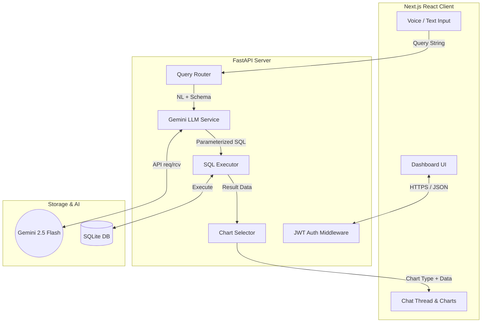

# QueryLens System Architecture

QueryLens is a conversational Business Intelligence (BI) dashboard that translates natural language questions into executable SQL, runs the queries against an SQLite database, and returns the data visualized in an interactive, auto-selected chart.

This document outlines the system's architecture, data flow, component design, and the strict security measures (AthenaGuard) that govern its operation.

---

## 1. High-Level Architecture

QueryLens uses a standard three-tier architecture with a Next.js React frontend, a FastAPI Python backend, and an SQLite database for data storage, augmented by Google's Gemini LLM for natural language processing.

---

## 2. Core Request Flow (NL to Dashboard)

When a user submits a query (e.g., *"What is the average price by fuel type?"*), the system executes the following synchronous pipeline:

1. **Input & Sanitization:** The frontend sends the query to `POST /api/query`. The backend immediately sanitizes the input using `bleach` to prevent XSS injection.
2. **Context Assembly:** The backend fetches the current database schema (either the default BMW dataset or a user-uploaded custom CSV schema) and loads the last 5 conversation turns from `query_history` to support context-aware follow-up questions.
3. **NL to SQL (LLM):** The query, schema, and conversation context are sent to `gemini-2.5-flash` using the `google-genai` SDK. The LLM is strictly instructed via prompt engineering to return **only** a valid SQLite SELECT statement with `?` placeholders, and a separated list of parameter values.
4. **SQL Validation:** The generated SQL undergoes structural validation to ensure it begins with `SELECT` and contains no forbidden mutative keywords (`DROP`, `DELETE`, `INSERT`, etc.).
5. **Execution:** The SQL and its extracted parameters are executed against SQLite using `cursor.execute(sql, params)`. **No string interpolation is ever used.**
6. **Chart Selection:** A deterministic algorithm (`chart_selector.py`) inspects the SQL syntax and the shape of the returned data (e.g., detects time series, categorical counts, percentages) to select the optimal Recharts component (Line, Bar, Pie, Scatter, or Stat Card).
7. **Parallel Insight Generation:** While the chart is being selected, the backend concurrently runs three separate Gemini calls:
   - Generate a concise Chart Title.
   - Generate 2-3 bullet-point Key Insights based on the data summary.
   - Generate a plain-English explanation of the query.
8. **Response:** The frontend receives the data, chart type, and insights, rendering them immediately via the `ChartRouter` component.

---

## 3. Frontend Architecture (Next.js)

The frontend is a **Next.js 14 App Router** application built predominantly as a Single Page Application (SPA) dashboard.

- **Styling:** Tailwind CSS with a custom Glassmorphism aesthetic and `next-themes` for seamless light/dark mode toggling.
- **State Management:** Custom React Hooks (`useQuery`, `useAuth`, `useHistory`) manage API interactions, loading states, and side effects.
- **Visualizations:** `recharts` is dynamically wrapped by the `ChartRouter`, which receives the `chart_type` string from the backend and mounts the corresponding chart component.
- **Voice Integration:** Uses the browser's native `Web Speech API` (`SpeechRecognition`) for real-time transcription, automatically submitting the query when the user stops speaking.

---

## 4. Backend Architecture (FastAPI)

The backend is built for speed and strict schema enforcement using **FastAPI** and **Pydantic**.

- **Endpoints:** 
  - `/api/auth/token`: Issues short-lived JWTs.
  - `/api/query`: The core NL-to-SQL pipeline.
  - `/api/upload`: Handles custom CSV ingestion.
- **LLM Integration (`gemini.py`):** Uses a thread-safe singleton pattern for the `google.genai.Client` to avoid unnecessary re-instantiation overhead on every request.
- **Rate Limiting:** Implemented via `slowapi` to restrict request velocity (e.g., 30 queries per minute per user).
- **Concurrency:** Heavily relies on Python's `asyncio` (`asyncio.gather` and `run_in_executor`) to parallelize outbound LLM requests for chart titles and insights, cutting response latency by ~50%.

---

## 5. Data & Storage Layer

### SQLite Database
QueryLens uses a single local SQLite database (`querylens.db`) containing three core tables:
1. `users`: Stores bcrypt-hashed credentials.
2. `query_history`: Logs every query, generated SQL, and timestamp, mapped to a unique `session_id`.
3. `vehicles` (Default Dataset): The initial BMW inventory data.

### Custom CSV Uploads
When a user uploads a CSV:
1. The file is validated for MIME type and magic bytes.
2. Column headers are aggressively sanitized (alphanumeric and underscores only).
3. Data is inserted via parameterized batches into a *session-scoped* transient table (e.g., `upload_abc123`).
4. A dynamic text representation of this new schema is generated and passed to the LLM instead of the default schema, making QueryLens instantly conversational over any tabular data.

---

## 6. The "AthenaGuard" Security Model

QueryLens was designed around a strict security manifesto called **AthenaGuard**, which dictates defense-in-depth across the entire stack.

**Key Security Principles Enforced:**
1. **Zero Raw SQL Concatenation:** All user-supplied filters are extracted by the LLM and passed as a tuple to SQLite's `cursor.execute(sql, params)`. SQL injection via string manipulation is structurally impossible.
2. **SELECT-Only Enforcement:** Regex validation blocks any query containing mutative commands prior to database execution.
3. **Pydantic Data Walls:** Raw database rows are never returned directly to the client; they must pass through strongly-typed Pydantic response models.
4. **Data Privacy in Prompting:** The LLM prompt *never* contains real database rows. It only receives the schema definitions (column names and types).
5. **No Stack Traces:** A global exception handler ensures internal server errors only yield generic JSON error messages to the client. 
6. **XSS Prevention:** Incoming text queries and outgoing LLM explanations are scrubbed using the `bleach` library before persistence or rendering.
